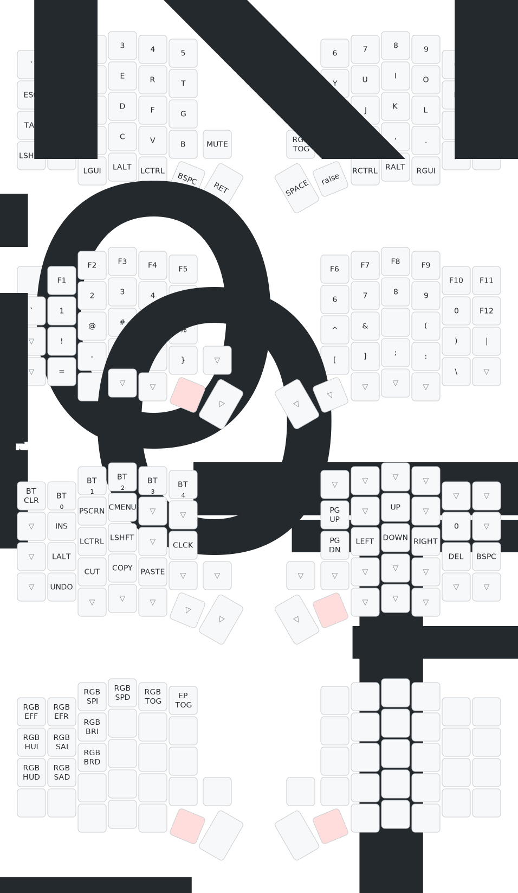

[](../../actions)
[](../../releases/latest)

# Sofle V2 ZMK Firmware
Wireless Sofle Choc V1 with Nice!Nano v2, OLED displays, and RGB underglow.

## Keymap (4 layers)



### Layer 0: BASE
```
|   `   |  1   |  2   |  3   |  4   |  5   |                     |  6   |  7   |  8   |  9   |  0   | DELETE|
|  ESC  |  Q   |  W   |  E   |  R   |  T   |                     |  Y   |  U   |  I   |  O   |  P   | BKSPC |
|  TAB  |  A   |  S   |  D   |  F   |  G   |                     |  H   |  J   |  K   |  L   |  ;   |   '   |
| SHIFT |  Z   |  X   |  C   |  V   |  B   | RGB TOG |  |        |  N   |  M   |  ,   |  .   |  /   | SHIFT |
                   | GUI | ALT  | CTRL | LOWER|  ENTER  |  | SPACE | RAISE| CTRL | ALT  | GUI  |
```
Encoder: Left = Vol Down/Up (reversed), Right = RGB On/Off (click)

### Layer 1: LOWER (hold LOWER)
```
|       |  F1  |  F2  |  F3  |  F4  |  F5  |                     |  F6  |  F7  |  F8  |  F9  | F10  | F11   |
|   `   |  1   |  2   |  3   |  4   |  5   |                     |  6   |  7   |  8   |  9   |  0   | F12   |
|       |  !   |  @   |  #   |  $   |  %   |                     |  ^   |  &   |  *   |  (   |  )   |   |   |
|       |  =   |  -   |  +   |  {   |  }   |         |  |        |  [   |  ]   |  ;   |  :   |  \   |       |
                   |      |      |      |      |         |  |        |      |      |      |      |
```

### Layer 2: RAISE (hold RAISE)
```
| BTCLR | BT1  | BT2  | BT3  | BT4  | BT5  |                     |      |      |      |      |      |       |
|       | INS  | PSCR | MENU |      |      |                     | PGUP |      |  ^   |      |      |       |
|       | ALT  | CTRL |SHIFT |      | CAPS |                     | PGDN |  <-  |  v   |  ->  | DEL  | BKSPC |
|       | UNDO | CUT  | COPY |PASTE |      |         |  |        |      |      |      |      |      |       |
                   |      |      |      |      |         |  |        |      |      |      |      |
```

### Layer 3: ADJUST (hold LOWER + RAISE)
```
|  EFF  |  EFR  |  SPI  |  SPD  |  TOG  | EXTPWR|                     |      |      |      |      |      |       |
|  HUI  |  SAI  |  BRI  |       |       |       |                     |      |      |      |      |      |       |
|  HUD  |  SAD  |  BRD  |       |       |       |                     |      |      |      |      |      |       |
|       |       |       |       |       |       |         |  |        |      |      |      |      |      |       |
                   |       |       |       |       |         |  |        |      |      |      |      |
```

**Adjust legend:**
- Row 1 (controls): EFF/EFR = Effect Forward/Reverse, SPI/SPD = Speed Up/Down, TOG = RGB On/Off, EP_TOG = External Power
- Row 2 (increase): HUI = Hue Up, SAI = Saturation Up, BRI = Brightness Up
- Row 3 (decrease): HUD = Hue Down, SAD = Saturation Down, BRD = Brightness Down

## OLED Display
Both halves show a custom vertical OLED layout with:
- **Left (central)**: WPM counter, CapsLock indicator, layer name, modifier keys, Bluetooth profile
- **Right (peripheral)**: Cat animation, battery status

## Flashing
1. Flash `settings_reset.uf2` to both halves first (optional but recommended for clean state)
2. Flash `sofle_left-nice_nano_v2-zmk.uf2` to the left half
3. Flash `sofle_right-nice_nano_v2-zmk.uf2` to the right half
4. Enter bootloader: double-tap the BOOT button

### Bluetooth Pairing
- Select profile: hold RAISE, press BT1-BT5 (number row)
- Clear all bonds: hold RAISE, press BTCLR (top-left key)
- After clearing bonds, re-pair each profile from your device
